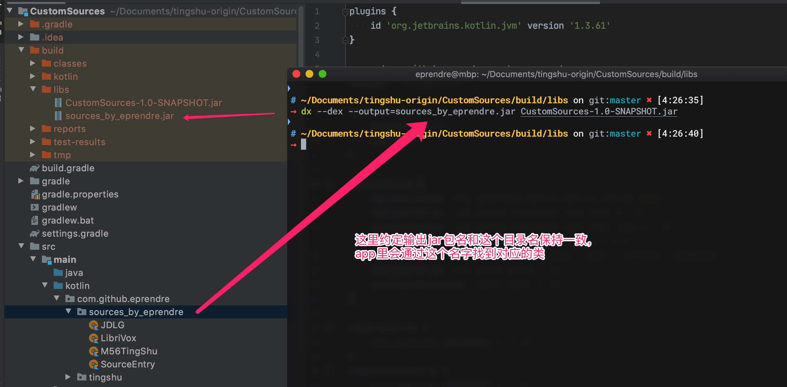

# 我的听书

一款自用的安卓听书app

## 下载

* [Release](https://github.com/eprendre/tingshu/releases)
* [Play Store](https://play.google.com/store/apps/details?id=com.github.eprendre.tingshu)

## 自定义源

请参考 `CustomSources` 项目，用 IDEA 打开即可。app 里面已经集成了网络请求库`Fuel` 以及HTML解析器 `Jsoup`， 此自定义源项目最好直接使用这两个库，不要引入额外的第三方库。

### 第一步：重构目录名

需要保证目录名独一无二

### 第二步：开始编写自定义源

在第一步的目录下面新建一个类继承`TingShu`，参考注释和代码示例编写相应的代码。附一份粗浅的代码执行逻辑图。

### 第三步：自定义源入口

把第二步编写好的一个或多个源添加至 `SourceEntry` 的 `getSources` 里， app 端会通过这个方法获取源。

### 第四步：打包 jar 文件

IDEA 的 gradle 自带了打包任务，双击即可。输出路径为：项目目录/build/libs/CustomSources-1.0-SNAPSHOT.jar

### 第五步：转 dex

约定输出的名字和第一步改的名字一致，并且输出后缀名也为`jar`。dx 命令位于安卓sdk下面，有安卓 sdk 的同学可以自行添加到环境变量或者把 jar 包复制过去执行。如果没有安卓sdk也不用担心，我从windows版的sdk里面提取了dx出来，位于 `dx_win` 目录。注意：若使用 java 代码则里面不能使用 lambda，否则到这一步会报错。

### 第六步：添加 jar 包至 app

有两种添加方式

1. 手动添加：把 jar 包移至手机 app 目录下: `/sdcard/Android/data/com.github.eprendre.tingshu(.debug)/files/jars/`， app 会在启动时自动加载。

2. 订阅添加。写一个接口，然后在 app 的自定义源管理右上角添加。 接口参考：[https://eprendre2.coding.net/p/tingshu/d/tingshu/git/raw/master/TingShuSources/external_sources.json](https://eprendre2.coding.net/p/tingshu/d/tingshu/git/raw/master/TingShuSources/external_sources.json)。订阅方式的好处是源作者可以更轻松的维护源，只要在接口里修改版本号，app 每次启动时会自动检测更新。
`version` 为数字类型，代表版本号。 app 以此来判断这个 jar 包是否有更新。
`entry_package` 为第一步提到的目录名，app下载 jar 包后也会自动命名为此名字。
`download_url` jar 包下载地址。

接口或者 jar 包都可以在 coding 或者 github 免费托管，国内用户推荐 coding 。
